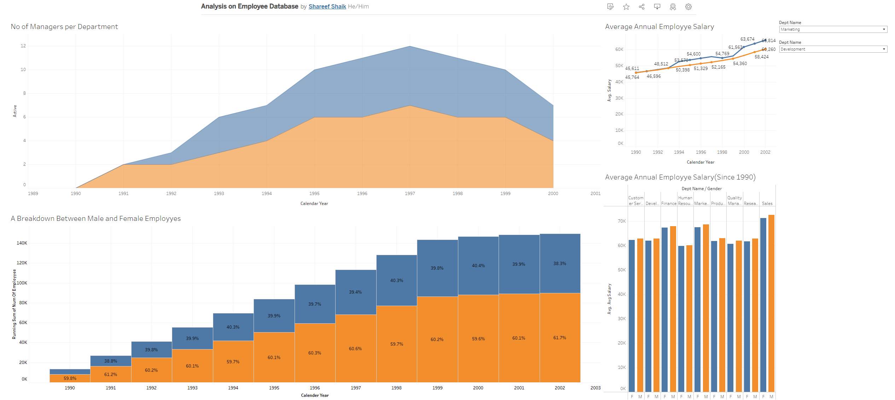
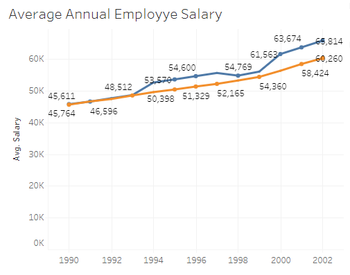
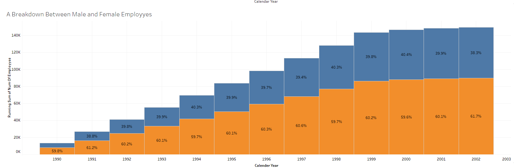
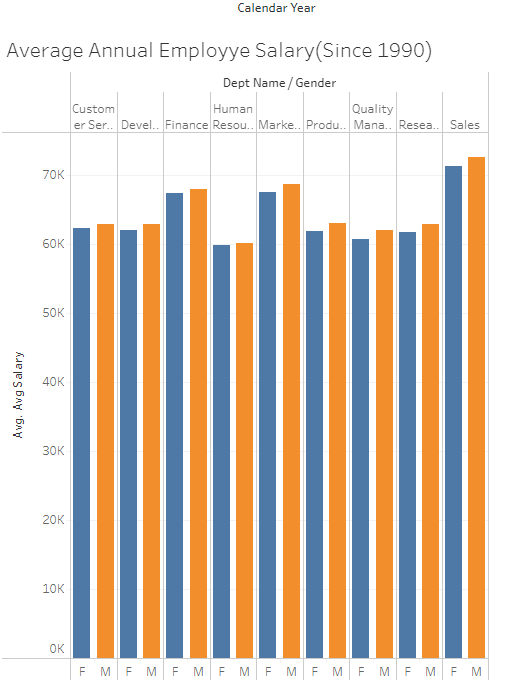

# Interactive Employee Dashboard: Analyzing Workforce Insights with Tableau

## Description
This GitHub repository contains an interactive employee dashboard developed using Tableau. The dashboard utilizes data from a SQL database, using four different SQL commands to gather and visualize key workforce metrics. The dashboard includes visualizations that provide insights into the employee distribution based on gender, average annual salary, number of managers per department, and the average salary comparison between male and female employees.

The dashboard is equipped with a user-friendly filter that allows users to analyze employee data based on different departments, making it easier to identify trends and patterns specific to each department.

## Accessing the Dashboard
You can directly access the interactive dashboard using the following link: [Employee Dashboard](https://public.tableau.com/shared/QDB535RB7?:display_count=n&:origin=viz_share_link)

## Screenshots

## Contribution
Contributions to improve and enhance the dashboard are welcome! Feel free to fork the repository, make changes, and submit a pull request.

Enjoy exploring the interactive employee dashboard and gaining valuable insights into your workforce data!
