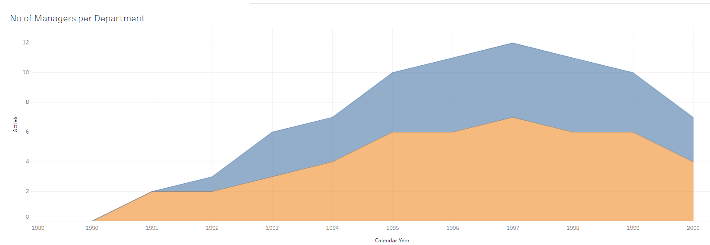

# Interactive Employee Dashboard: Analyzing Workforce Insights with Tableau


## Description
This GitHub repository contains an interactive employee dashboard developed using Tableau. The dashboard utilizes data from a SQL database, using four different SQL commands to gather and visualize key workforce metrics. The dashboard includes visualizations that provide insights into the employee distribution based on gender, average annual salary, number of managers per department, and the average salary comparison between male and female employees.

## SQL Commands Used
Here are the SQL commands used to gather the data for the visualizations:


```sql
	select year(d.from_date) as calender_year,
	e.gender,
	count(e.emp_no) as num_of_employyes
	from t_employees e
	join
	t_dept_emp d on d.emp_no = e.emp_no
	group by calender_year,e.gender
	having calender_year >=1990;

```
```sql
SELECT 
    d.dept_name,
    ee.gender,
    dm.emp_no,
    dm.from_date,
    dm.to_date,
    e.calendar_year,
    CASE
        WHEN YEAR(dm.to_date) >= e.calendar_year AND YEAR(dm.from_date) <= e.calendar_year THEN 1
        ELSE 0
    END AS active
FROM
    (SELECT 
        YEAR(hire_date) AS calendar_year
    FROM
        t_employees
    GROUP BY calendar_year) e
        CROSS JOIN
    t_dept_manager dm
        JOIN
    t_departments d ON dm.dept_no = d.dept_no
        JOIN 
    t_employees ee ON dm.emp_no = ee.emp_no
ORDER BY dm.emp_no, calendar_year;

```
```sql
SELECT 
    e.gender,
    d.dept_name,
    ROUND(AVG(s.salary), 2) AS salary,
    YEAR(s.from_date) AS calendar_year
FROM
    t_salaries s
        JOIN
    t_employees e ON s.emp_no = e.emp_no
        JOIN
    t_dept_emp de ON de.emp_no = e.emp_no
        JOIN
    t_departments d ON d.dept_no = de.dept_no
GROUP BY d.dept_no , e.gender , calendar_year
HAVING calendar_year <= 2002
ORDER BY d.dept_no;

```
```sql
DROP PROCEDURE IF EXISTS filter_salary;

DELIMITER $$
CREATE PROCEDURE filter_salary (IN p_min_salary FLOAT, IN p_max_salary FLOAT)
BEGIN
SELECT 
    e.gender, d.dept_name, AVG(s.salary) as avg_salary
FROM
    t_salaries s
        JOIN
    t_employees e ON s.emp_no = e.emp_no
        JOIN
    t_dept_emp de ON de.emp_no = e.emp_no
        JOIN
    t_departments d ON d.dept_no = de.dept_no
    WHERE s.salary BETWEEN p_min_salary AND p_max_salary
GROUP BY d.dept_no, e.gender;
END$$

DELIMITER ;

CALL filter_salary(50000, 90000);
    

```

The dashboard is equipped with a user-friendly filter that allows users to analyze employee data based on different departments, making it easier to identify trends and patterns specific to each department.

## Accessing the Dashboard
You can directly access the interactive dashboard using the following link: [Employee Dashboard](https://public.tableau.com/shared/QDB535RB7?:display_count=n&:origin=viz_share_link)

## Screenshots



## Contribution
Contributions to improve and enhance the dashboard are welcome! Feel free to fork the repository, make changes, and submit a pull request.

Enjoy exploring the interactive employee dashboard and gaining valuable insights into your workforce data!
